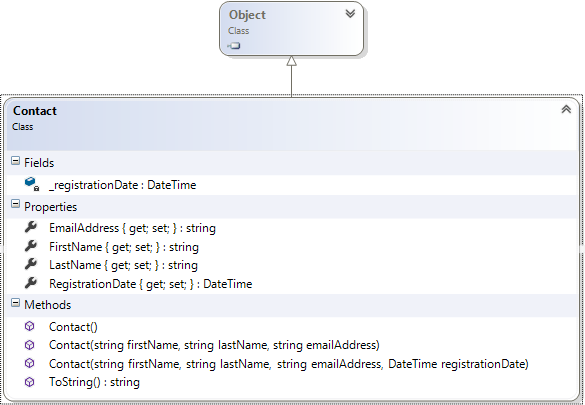
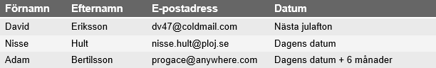
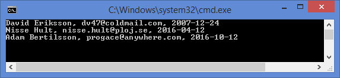

# Kontaktbara webb-besökare

## Problem

För att en besökare av en webbplats senare ska kunna kontaktas fyller besökaren i ett formulär med sin kontaktinformation. Informationen som är intressant att hantera är besökarens för- och efternamn, e-postadress och datumet då personen fyllde i formuläret.

Tanken är att då besökaren fyllt i ett formulär med sin kontaktinformation ska det skapas ett objekt med information som sedan kan lagras på lämpligt sätt.

Du ska skriva klassen ```Contact``` som ska hantera informationen om besökaren och ett litet konsolprogram som du kan använda för att testa om klassen fungerar innan den används i webbapplikationen. 

##### Klassen Contact

Skriv klassen ```Contact``` som ska ha följande innehåll:



Figur 1. Klassdiagram över klassen Contact som ärver från klassen Object

**Medlemsattribut / Fält** (_Fields_)<br/>
_E-postadressen_, som är av typen ```String```, ska hanteras av den autoimplementerade egenskapen ```EmailAddress```. Fältet behöver då inte deklareras utan blir underförstått, dvs. skapas och hanteras implicit (automatiskt) av kompilatorn.

_Förnamnet_ refererar till ett ```String```-objekt och liksom e-postadressen hanteras detta fält automatiskt av kompilatorn, via den autoimplementerade egenskapen ```FirstName```.

_Efternamnet_ refererar till ett ```String```-objekt som håller användarens efternamn, samt kapslas in av den autoimplementerade egenskapen ```LastName```.

_ _registrationDate_ är av typen ```DateTime``` (vilket är en ```struct``` och inte en klass!) och håller information om tillfället då besökaren registrerade sig. Detta är det enda fält som explicit ska deklareras (dvs. uttryckligen skapas av programmeraren). Fältet kapslas in av egenskapen ```RegistrationDate```.   

**Egenskaper** (_Properties_)<br/>
Klassen ska ha ovan nämnda, publika egenskaper knutna till de fyra (privata) fälten. (Se även avsnittet "Properties" i klassdiagrammet.)

**Metoder** (_Methods_)<br/>
Klassen ska ha följande konstruktorer:

- En konstruktor som kan anropas utan argument (”no-arg constructor” eller ibland standardkonstruktor på svenska). Konstruktorn ska tilldela tomma strängar ("") till fälten ```_firstName```, ```_lastName``` och ```_emailAddress```.  ```_registrationDate``` ska få värdet av dagens datum. För att undvika redundans (upprepning av kod) får ingen tilldelning ske i metodens kropp, utan denna konstruktor ska anropa treparameters-konstruktorn med nämnda standardvärden.
- En konstruktor som accepterar ett förnamn, ett efternamn och en e-postadress. ```_registrationDate``` ska få värdet av dagens datum. Även denna konstruktorkropp ska vara tom, och istället anropa fyraparameters-konstruktorn med specifierade argument.
- En konstruktor som accepterar ett förnamn, efternamn, e-postadress och ett datum. Detta är den enda konstrouktor som får innehålla kod som tilldelar värden till klassens fyra attribut.

Klassen ska ha en metod:

- Metoden ```ToString()```, som överskuggar (_override_) den version som finns i basklassen (```Object```), ska presentera förnamn, efternamn, e-postadress samt datum. Datumet ska presenteras utan klockslag.

##### Klassen Program

När du skrivit klassen ska du skriva ett program som testar klassen. Programmet ska skapa tre ```Contact```-objekt som ska innehålla följande data:


Tabell 1. Förväntade testdata för Program-klassen.

Programmet ska skapa tre separata objekt med hjälp av de tre olika konstruktorerna. Genom att använda metoden ```ToString()``` i klassen ```Contact``` ska aktuella kontaktdata presenteras i ett konsolfönster. I samband med att du utnyttjar standardkonstruktorn för att skapa ett objekt, måste du använda egenskaperna för att tilldela objektet förnamn, efternamn, etc. (se översta raden i tabellen med testdata).

## Testa programmet

En programkörning ska se ut som i skärmdumpen nedan.



Figur 2. Konsollutskrift efter att klassen Contact har implementerats korrekt.

## Mål

Efter att ha gjort uppgiften ska du:

- Veta hur du skapar objekt med hjälp av olika, överlagrade, konstruktorer.
- Förstå innebörden av ```public``` och ```private``` samt vikten av att alltid kapsla in klassens data med privat åtkomst.
- Känna till hur autoimplementerade egenskaper fungerar och kan stödja "inkapsling".
- Ha skaffat nödvändig kännedom om typen ```DateTime``` för att kunna hantera datum.
- Känna till vad överskuggning (_override_) av en metod i en basklass (```Object```) innebär och hur (```toString```) används för att skapa en sträng-representation av klassen.

## Tips

Den statiska egenskapen ```DateTime.Today``` returnerar dagens datum! ```DateTime``` har även metoder för att lägga till år, månader, etc. till ett befintligt datum.

Läs om:

+ Grunderna om klasser och objekt hittar du i inledningen av kapitel 5, som bl.a. tar upp saker som konstruktorer (_constructors_), accessmodifierare (_access modifiers_), fält (_fields_) och egenskaper (_properties_).

[Lösning](solution/README.md)